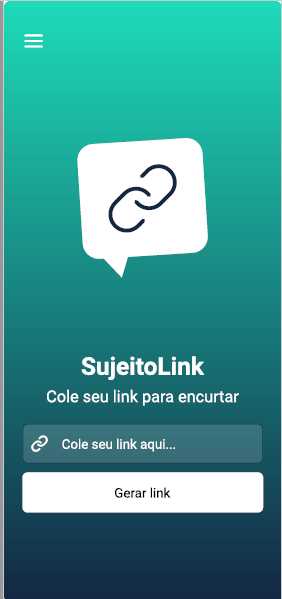

<h1 align="center">
  &#x1F4F1; MyLink - Encurtador de links &#x1F4F1;
</h1>

<p align="center">
   

  

  

  <br>
  
  <a href="https://www.codacy.com/manual/Gabriel4420/Insider.3.0?utm_source=github.com&amp;utm_medium=referral&amp;utm_content=Gabriel4420/Insider.3.0&amp;utm_campaign=Badge_Grade">
    
  </a>
  
  


  <a href="https://www.linkedin.com/in/gabriel-rodrigues-perez-2069b072/">
    
  </a>
</p>

---

<p align="center">
  
</p>

---

# Indice

- :rocket: [Sobre o Projeto](#rocket-sobre-o-projeto)
- 👨‍💻️ [Tecnogias utilizadas](#%EF%B8%8F-tecnogias-utilizadas)
- 📦️ [Como utilizar o projeto](#%EF%B8%8F-como-utilizar-o-projeto)
---

## :rocket: Sobre o Projeto

A proposta do myLink é ajudas as pessoas utilizando a api da bitly para encurtar links grandes e gerar mais acessibilidade com isso.

---

## 👨‍💻️ Tecnogias utilizadas

O projeto foi desenvolvido utilizando as seguintes tecnologias:

- [React-Native](https://github.com/expo/react-native/archive/sdk-41.0.0.tar.gz)


### Dependências

- [Async-Storage](https://reactnative.dev/docs/asyncstorage)
- [React-navigation](https://reactnavigation.org/docs/getting-started/)
- [axios](https://axios-http.com/docs/intro)
- [expo](https://docs.expo.io)
- [styled-components](https://styled-components.com)
- [react-dom](https://reactjs.org/docs/react-dom.html)

### Padronização de código

  - [ESLint](https://eslint.org/)
  - [Prettier](https://prettier.io/)

### IDE

  - [Visual Studio Code](https://code.visualstudio.com/)

---

## 📦️ Como utilizar o projeto

Para copiar o projeto, utilize os comandos:

```bash
  # Clonar o repositório
  ❯ git clone https://github.com/Gabriel4420/Insider.3.0.git

```
Para instalar as dependências e iniciar o projeto, você pode utilizar o expo ou yarn:

**Utilizando yarn**

```bash
  # verificar as dependências
  ❯ expo install

  #inicializar o projeto
  ❯ expo start
```

**Utilizando yarn**

*PS: utilize o yarn install, para atualizar as dependências, tome cuidado, pois dependendo da versão da dependência, pode ser que o projeto não funcione como o esperado.*

```bash
  # verificar as dependências
  ❯ yarn install

  #inicializar o projeto
  ❯ yarn start
```

---

<h4 align="center">
  Feito com ❤️ por Gabriel Rodrigues 👋️ <a href="mailto:gabriel_rodrigues_perez@hotmail.com">Entre em contato!</a>
</h4>

<p align="center">

  <a href="https://www.linkedin.com/in/gabriel-rodrigues-perez-2069b072/">
    
  </a>
  <a href="https://www.facebook.com/gabriel.rodrigues.perez">
    
  </a>
  <a href="https://www.instagram.com/gabriel_rodrigues_perez/">
    
  </a>
  
  
</p>